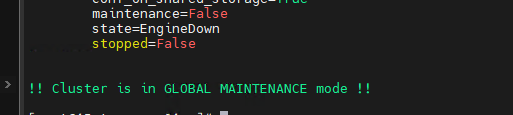
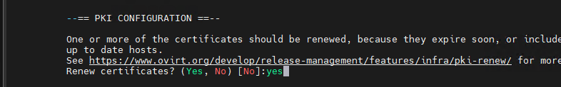
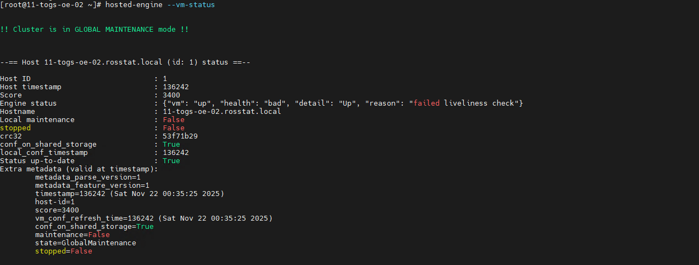
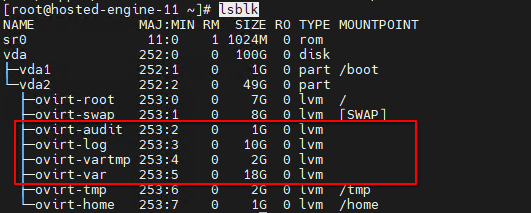

# Заметки 

## Обновление просроченного сертификата Engine (вариант Hosted-engine)

признаки : 
  - отсутсвует возможность аутентифкации на портале 
  - на странице входа присутсвует предупрежедние 
  
---
* включить режим глобального обслуживания
```bash
#  команда выполняется на узлах с разрешенным запуском HostedEngine
hosted-engine --set-maintenance --mode=global
```
* проверить статус 
```bash 
hosted-engine --vm-status
```
ожидаемый результат


* запуск установки c отключением проверки global maintenance
```bash 
# команда выполняется на HostedEngine
engine-setup --offline --otopi-environment=OVESETUP_CONFIG/continueSetupOnHEVM=bool:True
```
на вопрос обновления перевыпуск сертификатов отвечаем "да" (на все остальные вопросы отвечаем значениями по умолчанию)


* после завершения процедуры проверить процедуру аутентификации на портале 
* отключить режим обслуживания 
```bash
#  команда выполняется на узлах с разрешенным запуском HostedEngine
hosted-engine --set-maintenance --mode=none
```

## Снимки 

Проблема при удалении снимков 
* Выключить VM 
* проверить список заблокированных образов (Engine)
```bash 
/usr/share/ovirt-engine/setup/dbutils/unlock_entity.sh -t all -qc
```
* выполнить разблокировка по списку 
```bash
/usr/share/ovirt-engine/setup/dbutils/unlock_entity.sh -t Image -i <item-id>
```

## Зацикливание ввода учетных данных при доступе к BMC (Aquarius)

Необходимо перезапустить BMC утилитой ipmitool 

```bash 
ipmitool -I lanplus -H <BMC-IP> -U <login> -P <passsword> mc reset cold
```

## Повреждение файловой системы виртйальной машины HostedEngine

Призанки: 
* отсутствует сетевой доступ при запущенной VM 
* вывод статуса VM содержит информацию об ошибке определения состояния сервисов 
  


Причина: 
* аварийная остановка VM 
  
Решение: 
* подключиться к консоле VM c хоста на котором запущена VM ```hosted-engine --console```
* список проблемных партиций можно определить выполнив команду ```lsblk```



* выполнить восстановление файловой системы 
```bash
xfs_repair -L /dev/ovirt/log
xfs_repair -L /dev/ovirt/var
xfs_repair -L /dev/ovirt/tmp
```
* выключить VM 
* запустить VM командой ```hosted-engine --vm-start```   