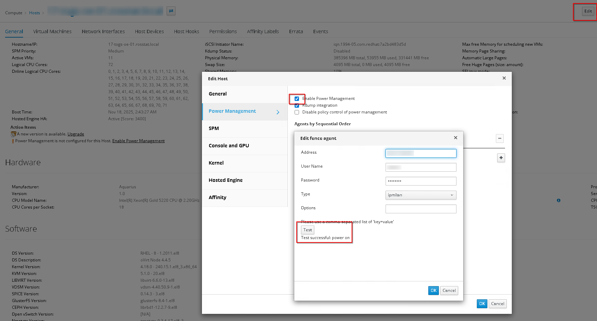
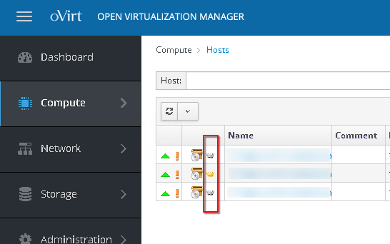
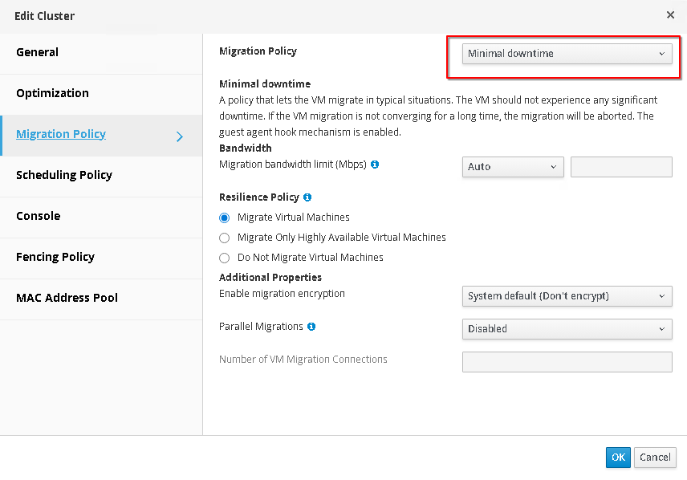
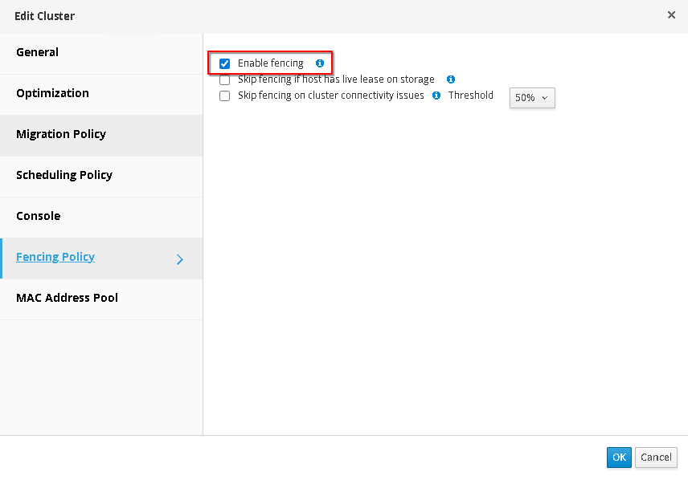
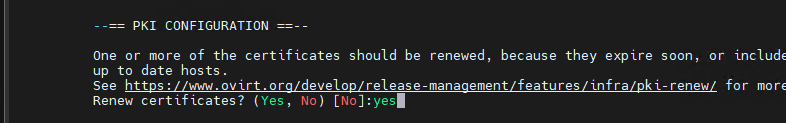
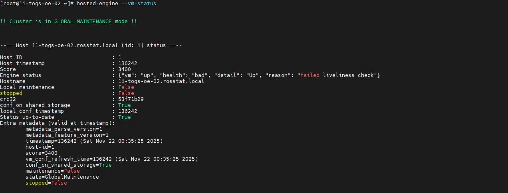
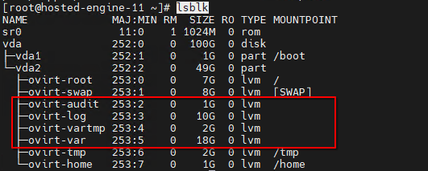

# Заметки 


## Необходимые настройки для инфраструктуры ovirt
Для предсказуемой отработки отказа хоста виртуализации необходимо выполнить следующие настройки: 
Все хосты должны быть в состоянии "UP"
Для хостов:
- настройка управления питания (в свойствах узла необходимо указать адрес BMC и учетные данные для подключения )
  
  

> [!IMPORTANT]
>  не использовать агрегацию сетевых интерфейсов серверов для подключения хранилища по протоколу iSCSI 
  
  
Для HostedEngine:
- отключение режима глобального обслуживания  
```bash
#  команда выполняется на узлах с разрешенным запуском HostedEngine
hosted-engine --set-maintenance --mode=global
```
Для кластера: 
- вспомогательные сервисы для запуска engine должны быть запущены минимум на 2х узла (желательно 3)
  
- настройки для оптимизации распределения ресурсов
  
  
  


## Обновление просроченного сертификата Engine (вариант Hosted-engine)

признаки : 
  - отсутсвует возможность аутентифкации на портале 
  - на странице входа присутсвует предупрежедние 
  
---
* включить режим глобального обслуживания
```bash
#  команда выполняется на узлах с разрешенным запуском HostedEngine
hosted-engine --set-maintenance --mode=global
```
* проверить статус 
```bash 
hosted-engine --vm-status
```
ожидаемый результат


* запуск установки c отключением проверки global maintenance
```bash 
# команда выполняется на HostedEngine
engine-setup --offline --otopi-environment=OVESETUP_CONFIG/continueSetupOnHEVM=bool:True
```
на вопрос обновления перевыпуск сертификатов отвечаем "да" (на все остальные вопросы отвечаем значениями по умолчанию)

```bash
engine-setup --offline --otopi-environment="OVESETUP_CONFIG/continueSetupOnHEVM=bool:True" --otopi-environment="OVESETUP_PKI/renew=bool:True"
```
обновление с полным подавлением интерактивных вопросов


* после завершения процедуры проверить процедуру аутентификации на портале 
* отключить режим обслуживания 
```bash
#  команда выполняется на узлах с разрешенным запуском HostedEngine
hosted-engine --set-maintenance --mode=none
```

## Снимки 

Проблема при удалении снимков 
* Выключить VM 
* проверить список заблокированных образов (Engine)
```bash 
/usr/share/ovirt-engine/setup/dbutils/unlock_entity.sh -t all -qc
```
* выполнить разблокировка по списку 
```bash
/usr/share/ovirt-engine/setup/dbutils/unlock_entity.sh -t Image -i <item-id>
```
* разблокировка всех объектов связанных с определенной VM
```bash
/usr/share/ovirt-engine/setup/dbutils/unlock_entity.sh -t vm -r <vm-name>
```

## Зацикливание ввода учетных данных при доступе к BMC (Aquarius)

Необходимо перезапустить BMC утилитой ipmitool 

```bash 
ipmitool -I lanplus -H <BMC-IP> -U <login> -P <passsword> mc reset cold
```

## Повреждение файловой системы виртуальной машины HostedEngine

Призанки: 
* отсутствует сетевой доступ при запущенной VM 
* вывод статуса VM содержит информацию об ошибке определения состояния сервисов 
  


Причина: 
* аварийная остановка VM 
  
Решение: 
* подключиться к консоле VM c хоста на котором запущена VM ```hosted-engine --console```
* список проблемных партиций можно определить выполнив команду ```lsblk```



* выполнить восстановление файловой системы 
```bash
xfs_repair -L /dev/ovirt/log
xfs_repair -L /dev/ovirt/var
xfs_repair -L /dev/ovirt/tmp
```
* выключить VM 
* запустить VM командой ```hosted-engine --vm-start```   
  
## Не загружаются образы на домен хранения 
Признаки: 
* процедура переходит в состояние "приостановлено системой"

Причина: 
* отсутствует доверие корнекому сертификату HostedEngine со стороны узла виртуализации

Решение:
* загрузить корневой сертификат и запустить процесс повторной генерации сертификат узла (можно использовать следующий сценарий)
```bash
#!/bin/bash
#$1 - hostname engine 
#$2 - пароль root (engine) 

[! -d /etc/pki/ovirt-engine ] && mkdir -p /etc/pki/ovirt-engine
sshpass -p "$2" scp -o StrictHostKeyChecking=no -o UserKnownHostsFile=/dev/null root@$1:/etc/pki/ovirt-engine/ca.pem /etc/pki/ovirt-engine/
vdsm-tool configure --force
systemctl restart vdsmd
systemctl restart ovirt-imageio
``` 

##  Ошибка при попытке аутентификации "Unable to log in because the user account is disabled or locked. Contact the system administrator"
Признаки: 
* сообщение при попытке аутентификации "Unable to log in because the user account is disabled or locked. Contact the system administrator"
* статус пользователя "locked" (проверяется командой ```ovirt-aaa-jdbc-tool user show admin```)


Причина: 
* блокировка пользователя системой резервного копирования (СРК не закрывает сессии)

Решение:
* разблокировать пользователя ```ovirt-aaa-jdbc-tool user unlock admin```
* отключить политику блокировки пользователя 
```bash
ovirt-aaa-jdbc-tool settings set --name=MAX_FAILURES_PER_INTERVAL --value=0
ovirt-aaa-jdbc-tool settings set --name=MAX_FAILURES_PER_MINUTE --value=0  
ovirt-aaa-jdbc-tool settings set --name=MAX_FAILURES_SINCE_SUCCESS --value=0
ovirt-aaa-jdbc-tool settings set --name=LOCK_MINUTES --value=0
``` 
* ограничить время активной сессии ```engine-config -s UserSessionTimeOutInterval=60```